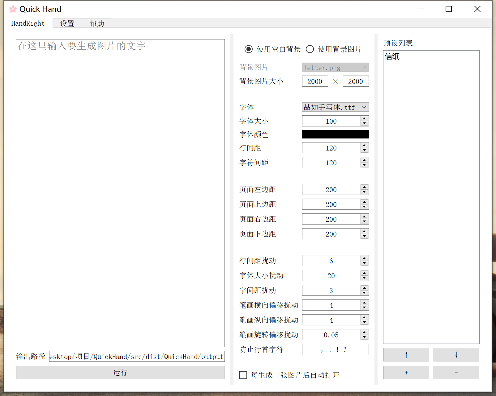

#  Quick Hand

## 📝 介绍

快速的仿手写文字的图片生成器。基于 https://github.com/Gsllchb/Handright/ 的 GUI。

它是开源的，你可以免费使用它。下载请到 release 界面。

目前原作者在两个仓库更新：

- https://github.com/HaujetZhao/QuickHand
- https://gitee.com/haujet/QuickHand

关于软件参数的帮助，你可以参照：https://github.com/Gsllchb/Handright/blob/master/docs/tutorial.md

界面预览：



## 🔮 使用说明

原理：首先，在水平位置、竖直位置和字体大小三个自由度上，对每个字的整体做随机扰动。随后，在水平位置、竖直位置和旋转角度三个自由度上，对每个字的每个笔画做随机扰动。

Windows 64 位系统的用户：下载软件发行版压缩包，解压，双击运行里面的 `QuickHand.exe` 就可以运行了。

- 请将需要用到的字体文件（ttf 格式）放到软件根目录的 `fonts` 文件夹中
- 请将需要用到的背景图片放到软件根目录的 `backgrounds` 文件夹中

排版关系参考：


## 🔨 具体打包方法

建议Python版本为：3.9

由于原作者使用的 `pyside2`目前只支持到了 `Python3.10`，使用较为新的Python版本时，会出现无法安装环境的问题。因此，目前我在win10上的解决方案为使用conda建立虚拟环境。

只要安装上 requirements.txt 中的 python 依赖包，确保源码能跑起来，再用 pyinstaller 使用以下的命令将 QuickHand.py 打包：

```
pyinstaller --hidden-import pkg_resources.py2_warn --noconfirm -w  -i icon.ico QuickHand.py

```

再将：

- `backgrounds` 文件夹
- `fonts` 文件夹
- `assets` 文件夹
- `README_zh.html` 文件
- `database.db` 文件
- `icon.ico` 文件
- `sponsor.jpg` 文件
- `style.css` 文件

都复制到打包出的 `/dist/QuickHand` 文件夹根目录，再打包成压缩包，即可。

Linux 和 MacOS 用户可能还需要将打包出的 QuickHand 文件夹根目录内的可执行文件加上执行权限才行，并且不能用 zip 等打包格式，因为这会使得可执行权限丢失。建议使用 tar.gz 格式压缩。

MacOS 用户不能使用 `icon.ico` 图标，请手动将其转换为 `icon.icns` 格式图片，放到打包出的 QuickHand 文件夹根目录内。

## 😀 改动与更新

在原作者基础上，我做了以下改动：

* 合并了 `repuirements.txt`
* 其他还在搞。。。

未来的方向：

* 添加文件输入的功能
* 使用GitHu Aciton自动打包
* 保持Handright和Pillow为较新版本
